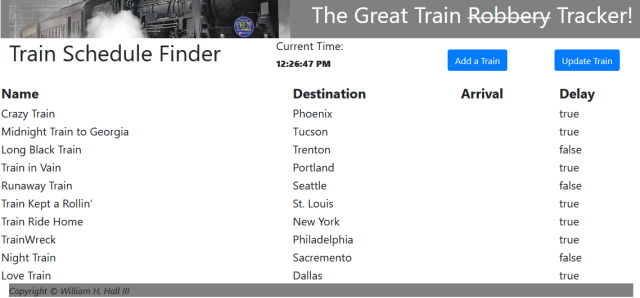

# Train-Scheduler

This site is meant to display arrival times for various fictional trains. The idea I had was to include music according to the train names, as well as use random coordinates for each train's start point, and then calculate how long before the train arrived at the station.

## Screenshot

# Usage

Users can act as administrators, and add trains to the list as they like, or just see when trains are arriving and/or if they are on time. 

## Languages/Frameworks 

html, css, javascript, jquery, bootstrap, moment.js 